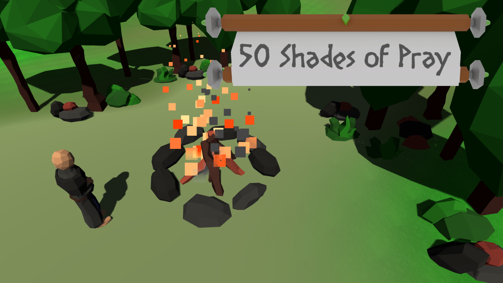

# Ludum Dare 46 Jam: 50 Shades of Pray!

This is our submission for the Ludum Dare 46 game jam, whose theme was 'Keep it alive'!

Our take on the theme was to create a game where we let the player create a religion and they try to keep it alive while an enemy AI is doing the exact same thing.

[Click here to play](https://ioan-pop.github.io/LD46Jam/)  
[Click here to go to Ludum Dare submission](https://ldjam.com/events/ludum-dare/46/50-shades-of-pray)

Created by: [Robert Ochinski](https://github.com/ochinski) and [Ioan Pop](https://github.com/ioan-pop)
